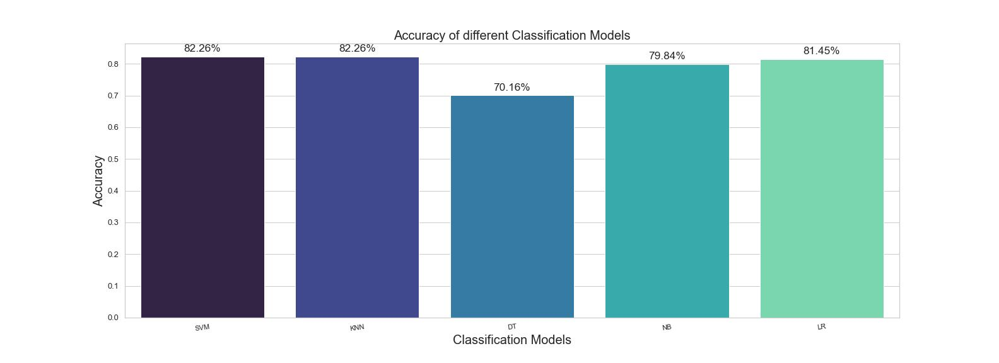

# ML-Projects

Our project is about <i>weather prediction</i>. Here we will predict whether it will rain or not using some weather conditions. We have collected our dataset from <a href="https://www.kaggle.com">Kaggle</a>. There are six attributes in our dataset. They are—<mark><i>date</i></mark>, <mark><i>precipitation</i></mark>, <mark><i>temp_max</i></mark>, <mark><i>temp_min</i></mark>, <mark><i>wind</i></mark>, and <mark><i>weather</i></mark>. Where the first five are independent variables and the last one is the dependent variable. The weather attribute contains 5 different classes—drizzle, rain, sun, snow, and fog. We have visualized the dataset with different plotting for checking the outliers or skew. 

We have done some preprocessing and standardization using <b>DataFrame.Quantile()</b> and <b>StandardScale()</b>.
As it is a classification problem, we have trained different ML classification and regression models with the dataset. Namely, <a href="https://scikit-learn.org/stable/modules/svm.html#:~:text=Support%20vector%20machines%20(SVMs)%20are,than%20the%20number%20of%20samples.">Support Vector Machine (SVM)</a>, <a href="https://scikit-learn.org/stable/modules/tree.html#:~:text=Decision%20Trees%20(DTs)%20are%20a,as%20a%20piecewise%20constant%20approximation.">Decision Tree (DT)</a>, <a href="https://scikit-learn.org/stable/modules/generated/sklearn.linear_model.LogisticRegression.html">Logistic Regression (LR)</a>, <a href="https://scikit-learn.org/stable/modules/neighbors.html">K-Nearest Neighbors (KNN)</a>, and <a href="https://scikit-learn.org/stable/modules/generated/sklearn.naive_bayes.GaussianNB.html">Naive Bayes (NB)</a>. 

After comparing all the models, <mark style="background-color: green; color: white">SVM & KNN achieved the best score, which is 82.26%</mark>. In contrast, DT provides the lowest score, 70.16%. 

# Dataset Overview

<h4>About Dataset</h4>

There are six attributes in our dataset. They are—<mark><i>date</i></mark>, <mark><i>precipitation</i></mark>, <mark><i>temp_max</i></mark>, <mark><i>temp_min</i></mark>, <mark><i>wind</i></mark>, and <mark><i>weather</i></mark>. Where the first five are independent variables and the last one is the dependent variable. 

Let’s describe how this data set work to predict the weather-
<ul>
<li>Date -- We use the date for check how much rain occur in one month and which month it occurs more.So that every year we be aware that this month rain may occur or not.</li>
<li>Precipitation -- It means product of the condensation of atmospheric water.All the forms in which water falls on the land surface and open water bodies as rain,sleet,snow,hail or drizzle.</li>
<li>Temp_max,Temp_min -- Predict the maximum temperature and minimum temperature.As we know rainfall and temperature are important climatic inputs for agricultural production,especially in the context of climate change.However,accurate analysis and simulation of the joint distribution of rainfall and temperature are difficult due to possible interdependence between them.And the physical rationale behind the relationship between rainfall and temperature is that rainfall may affect soil moisture which may in turn affect surface temperature by controlling the partitioning between the sensible and heat.</li>
<li>Wind -- wind speed</li>
<li>Weather -- As we are going to predict the weather condition. Those are- drizzle,rain,sun,snow,fog.</li>
</ul>

<h4>Dataset link</h4>

The dataset available in https://www.kaggle.com/datasets/ananthr1/weather-prediction

# Result

The purpose of this project was to find a suitable classifier for weather prediction which will classify weather as accurately as possible.After applying 5 different model we can see that for this particular dataset, **KNN and Kernel SVM** have **performed better than the rest**. So we can shortlist these 2 to work on this project. This is exactly the same conclusion we arrived at by training each of those algorithms individually.
